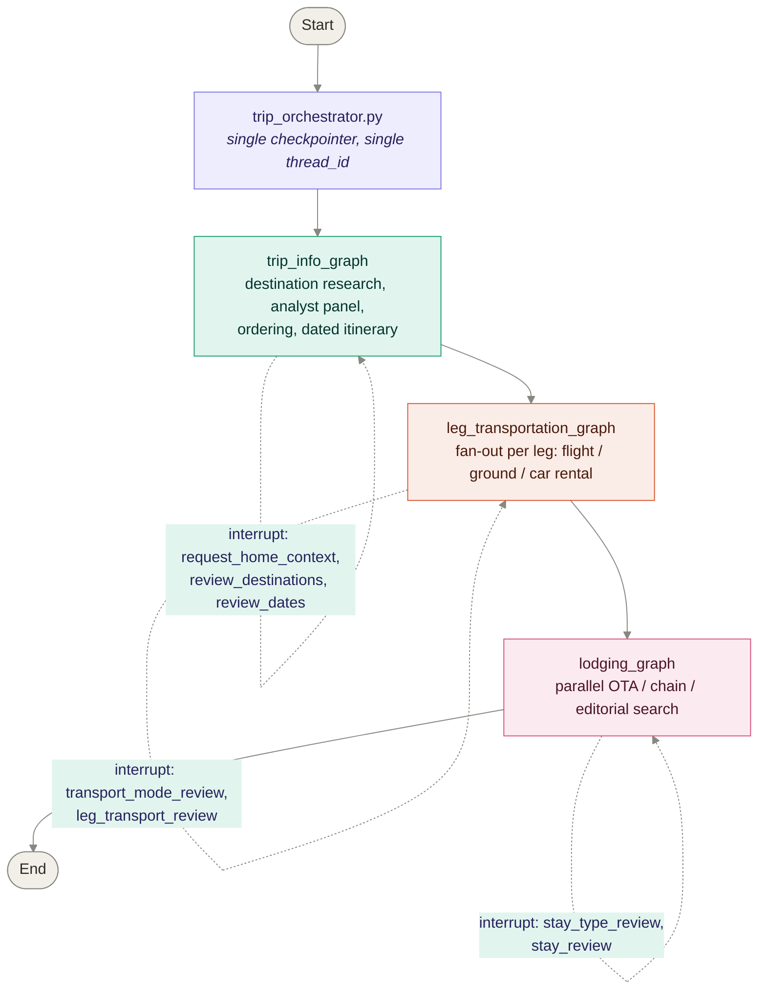

# AI Travel Planner

A multi-agent travel planning system built on LangGraph. A single traveler intent flows
through destination research, transportation planning, and lodging planning — each stage
running its own internal search/reconcile/recommend/review loop, with human-in-the-loop
interrupts at every decision point.

## Architecture

All three planning stages are compiled as child nodes under one parent orchestrator, which
shares a single checkpointer and thread ID across the whole run. That's what lets an
interrupt raised deep inside, say, the lodging fan-out propagate cleanly back to the caller
without any manual thread-copying between stages.



Each stage internally follows the same shape — search (parallel `Send()` fan-out) →
reconcile (confidence-tag corroborated vs. unverified results) → recommend (premium-tier
LLM ranking) → human review (`interrupt()`) → finalize:

```mermaid
%%{init: {'theme':'base', 'themeVariables': {
  'primaryColor': '#E1F5EE',
  'primaryTextColor': '#04342C',
  'primaryBorderColor': '#1D9E75',
  'lineColor': '#888780'
}}}%%
flowchart LR
    A[Search nodes<br/><i>Send() fan-out</i>] --> B[Reconcile<br/><i>confidence tagging</i>]
    B --> C[Recommend<br/><i>premium-tier ranking</i>]
    C --> D{Human review<br/>interrupt}
    D -->|approve / pick| E[Finalize]
    D -->|feedback| A

    style A fill:#E1F5EE,stroke:#1D9E75,color:#04342C
    style B fill:#E1F5EE,stroke:#1D9E75,color:#04342C
    style C fill:#EEEDFE,stroke:#7F77DD,color:#26215C
    style D fill:#FAEEDA,stroke:#BA7517,color:#412402
    style E fill:#F1EFE8,stroke:#888780,color:#2C2C2A
```

### Repo layout

| File | Role |
|---|---|
| `trip_orchestrator.py` | Parent graph — compiles the three subgraphs below as child nodes under one checkpointer |
| `trip_info_graph.py` | Destination research: analyst-panel simulation, candidate extraction, ordering, date computation, `request_home_context` |
| `leg_transportation_graph.py` | Per-leg fan-out across flight (Duffel), ground transport (Tavily + domain discovery), car rental |
| `lodging_graph.py` | Parallel stay search across Agoda, hotel chains, general OTAs, editorial sources; USD normalization; loyalty enrichment |
| `main.py` | Standalone flight-search graph + shared Duffel airport-cache helpers (`duffel_places_lookup`, `duffel_city_coords`, `duffel_city_country`) used by the other graphs |
| `models.py` | Pydantic models + null-safe extractors for Duffel API responses |
| `llm_config.py` | Three-tier `get_llm(tier)` factory (`premium` / `mid` / `cheap`) routed through OpenRouter |
| `langgraph.json` | Graph registration for LangGraph Studio / CLI |

## Setup

```bash
python -m venv venv
source venv/bin/activate   # Windows: venv\Scripts\activate
pip install -r requirements.txt
```

### Environment variables

Create a `.env` file in the repo root (already git-ignored):

```bash
OPENROUTER_API_KEY=...     # routes all three LLM tiers (Sonnet 5 / Haiku 4.5 / DeepSeek V4 Flash)
DUFFEL_API_KEY=...         # flight search + airport catalog
TAVILY_API_KEY=...         # TavilySearch / TavilyExtract
ANTHROPIC_API_KEY=...      # only needed if you switch a call site back to langchain_anthropic.ChatAnthropic directly

# Optional — enables LangSmith tracing, which is what powers the Studio trace view
LANGCHAIN_TRACING_V2=true
LANGCHAIN_API_KEY=...
LANGCHAIN_PROJECT=ai-travel-planner
```

No FX or currency API key is needed — `lodging_graph.py` hits the free
`frankfurter.app` endpoint for USD normalization.

## Running

### In LangGraph Studio (recommended for interrupt-driven graphs)

```bash
langgraph dev
```

This reads `langgraph.json` and opens Studio, where you can step through interrupts
(`transport_mode_review`, `stay_review`, etc.) interactively instead of hand-rolling a
CLI loop. Since the orchestrator now owns the checkpointer, a single thread in Studio
carries you through destination research → transportation → lodging without manually
copying thread state between separate graph invocations.

### As standalone scripts

Each subgraph file also runs directly for quick iteration outside Studio, e.g.:

```bash
python trip_info_graph.py
python leg_transportation_graph.py   # prompts for a pasted dated_itinerary JSON
python lodging_graph.py              # prompts for dated_itinerary + loyalty programmes
```

These use an `InMemorySaver` checkpointer and a REPL-style `while "__interrupt__" in result`
loop, printing each interrupt payload and prompting for a resume value — useful for
debugging one stage in isolation.

## `langgraph.json`

If your current file still lists the three subgraphs as separate top-level entries, add
the orchestrator alongside (or in place of) them so Studio can drive the whole pipeline
on one thread:

```jsonc
{
  "graphs": {
    "trip_orchestrator": "./trip_orchestrator.py:graph",
    // keep these if you still want to debug a single stage in isolation in Studio
    "trip_info": "./trip_info_graph.py:graph",
    "transportation": "./leg_transportation_graph.py:transport_graph",
    "lodging": "./lodging_graph.py:lodging_graph"
  }
}
```

## Development notes

**Subgraph checkpointer inheritance** — every child graph (`trip_info_graph`,
`leg_transportation_graph`, `lodging_graph`) must be compiled *without* its own
checkpointer so it inherits the orchestrator's. Passing a checkpointer at both levels
silently breaks interrupt propagation between stages.

**`INITIAL_STATE` must seed every key** the orchestrator's unified state touches —
several nodes across the subgraphs index state directly (`state["key"]`) rather than via
`.get()`, so a missing key surfaces as a `KeyError` deep in a `Send()` branch rather than
at the top level where it's easy to diagnose.

**Double-interrupt trap** — don't combine a compile-time `interrupt_before=["node"]`
with a dynamic `interrupt()` call inside that same node. `trip_info_graph.py`'s
`destination_graph` hit this; only one interrupt mechanism per node.

**LLM tier discipline** — every call site must pass its tier explicitly. A `search_llm=None`
default that silently falls back to the module-level `llm` (premium) will route
high-volume extraction traffic onto Sonnet 5 without any error — this happened in
`lodging_graph.py` and cost ~3.8x more before being caught via OpenRouter usage logs, not
via any graph-level error. When adding a new search/extraction node, follow
`leg_transportation_graph.py`'s pattern of a dedicated `extraction_llm` variable rather
than reusing the premium `llm`.

**Structured output over OpenRouter** — every `ChatOpenAI` instance used with
`.with_structured_output(...)` should set `streaming=False` (already done in
`llm_config.get_llm`). Leaving streaming on has caused silent `CancelledError` cascades
across parallel `Send()` branches from OpenAI's partial-JSON accumulator.

**Tavily defensiveness** — `TavilySearch.invoke()` can return a plain string instead of
a `{"results": [...]}` dict on error; always route through a `_tavily_results()`
normalizer rather than calling `.get("results")` directly on the raw return value.

**Trace-driven debugging** — LangSmith Studio traces are the primary way to debug this
codebase, since most failures surface inside a `Send()`-fanned-out branch where a plain
stack trace loses the leg/stay context. When Studio's trace UI is unreliable, the
`print()` statements already scattered through `leg_transportation_graph.py`'s search
nodes are the fallback (search for `# DEBUG`).

## Roadmap

- Frontend development (unblocked now that the orchestrator is unified)
- Verify in Studio whether the `&selected_currency=USD` param on `DIRECT_RATE_SOURCES`
  is causing `search_rates_direct` to return empty results
- Resolve OpenRouter → DeepSeek V4 Flash latency (pin providers via `extra_body`, or move
  search nodes to the `mid` tier)
- Pre-arrival leg concept for late-arrival awareness on the first itinerary stop
- Validate DeepSeek's `with_structured_output` compatibility vs. Claude for
  extraction-tier nodes
